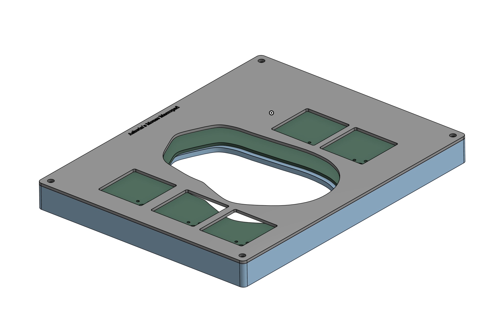
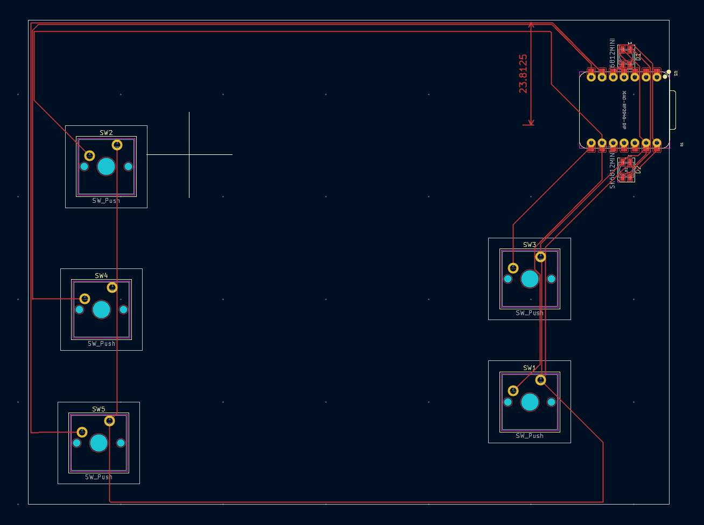
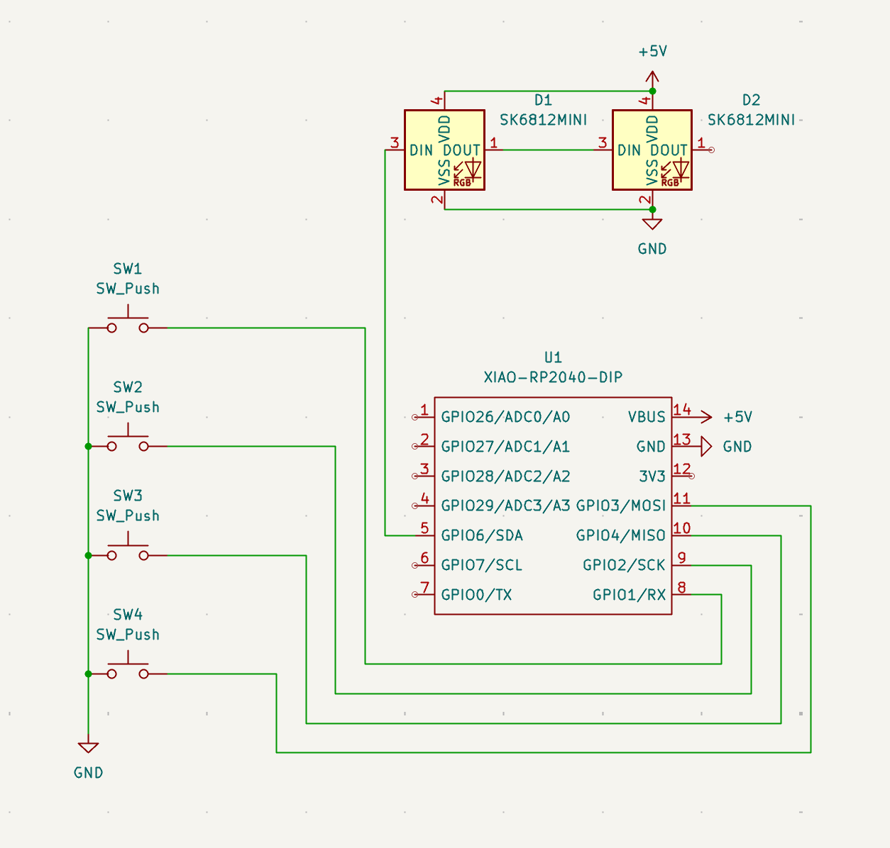
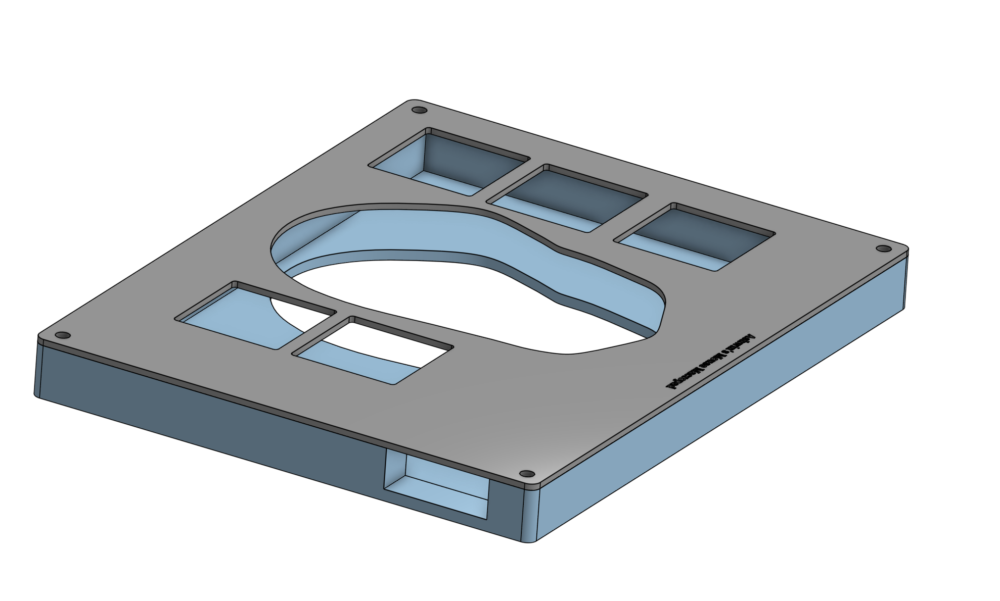

# Mouse-Macropad
A portable keyboard that moves along with your mouse, for easy one-handed key control. I am using the Logitech M720, so the outline of the shape in the middle of the casing and PCB is that of the mouse outline

## Properties
- Five Key Design
- RGB LED
- Customizable keycaps/Hotswappable Switches
- Compact and easily mobile

## Overall Design

## PCB Layout

## Schematic Layout

## Shell/Casing

# (BOM)
## Components

| Discription | Quantity |
|-----------|----------|
| Cherry MX Switches | 5 | 
| DSA keycaps | 5 | 
| SK6812 MINI-E LEDs | 2 | 
| XIAO RP2040 | 1 | 
| 3D Printable Case (Top/Bottom) | 2 |
